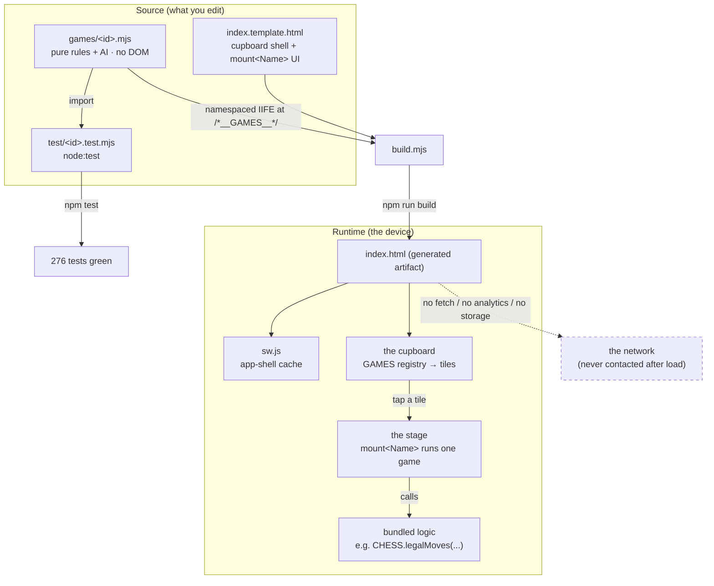

# Architecture overview

Parlour is a **single-file Progressive Web App** built from small pure-logic game
modules. The whole architecture exists to keep one promise checkable: *every game
is a tiny, auditable, tested module, and nothing leaves the device.*

## The spine

There are two boundaries that matter, and everything else follows from them:

1. **Logic vs. UI.** A game's *rules and AI* are pure ES-module functions in
   `games/<id>.mjs` — no DOM, no network, no storage, no globals. A game's
   *screen* is a `mount<Name>` function in `index.template.html` that reads the
   rules and paints them. The logic never imports the UI; the UI calls the logic.
2. **Source vs. artifact.** You edit `games/*.mjs` and `index.template.html`
   (source). `build.mjs` bundles them into `index.html` (artifact). The service
   worker caches that artifact so it plays offline forever.

## How a game reaches the screen

1. `index.template.html` declares a `GAMES` array — one entry per game:
   `{ id, name, glyph, blurb, badges, tier, mount }`.
2. `renderCupboard()` turns each entry into a tile in the grid (the *cupboard*).
3. Tapping a tile calls `openGame(g)`, which shows the *stage* and calls
   `g.mount(boardEl, helpers)`. The hash (`#chess`) makes games deep-linkable and
   the back button return to the cupboard.
4. The mount function drives one game: it calls the bundled logic (e.g.
   `CONNECT4.drop`, `CHESS.legalMoves`), renders the board, handles taps, and — in
   vs-computer mode — asks the module's AI for a move.

## The build contract (module → bundle)

`build.mjs` is deliberately tiny. For each `games/<id>.mjs` it:

1. finds every `export function|const|let|var|class <name>`,
2. strips the leading `export` keywords,
3. wraps the file in a **namespaced IIFE**:
   `const HEXCODLE = (function(){ …body… return { …names… }; })();`,
4. concatenates all of these and injects them into `index.template.html` at the
   `/*__GAMES__*/` marker, writing `index.html`.

The payoff: the *same* file is a real ES module `import`-able by `node:test` **and**
an inlined browser namespace (`HEXCODLE.dailyTarget(...)`), with no bundler
dependency and no duplicated logic. See
[ADR-0002](../adr/0002-pure-logic-game-modules.md).

## Offline & install

- `sw.js` caches the app shell (`./`, `index.html`, `manifest.webmanifest`,
  `icon.svg`) on install and serves it stale-while-revalidate, so the second
  launch works with the network off. Because the app makes no other requests,
  "offline" and "online" behave identically once cached.
- `manifest.webmanifest` makes it installable (name, felt-green `#2f5d50` theme,
  standalone display, maskable `icon.svg`).
- `404.html` redirects stray deep links back to the cupboard (for static hosts
  that serve it).

## Module map — where to look

| Concern | File(s) |
|---|---|
| **A game's rules + AI** | `games/<id>.mjs` |
| **A game's tests** | `test/<id>.test.mjs` |
| **A game's UI** | `mount<Name>` in `index.template.html` |
| **Launcher / routing / registry** | `GAMES`, `renderCupboard`, `openGame`, `closeGame` in `index.template.html` |
| **Bundler** | `build.mjs` |
| **Offline cache** | `sw.js` |
| **Generated page** | `index.html` (do not hand-edit) |
| **Install metadata** | `manifest.webmanifest`, `icon.svg`, `404.html` |
| **Privacy statement** | `PRIVACY.md`, [privacy-model.md](../privacy-model.md) |

For per-game details (player modes, AI style), see the
[game catalogue](../reference/games.md).
